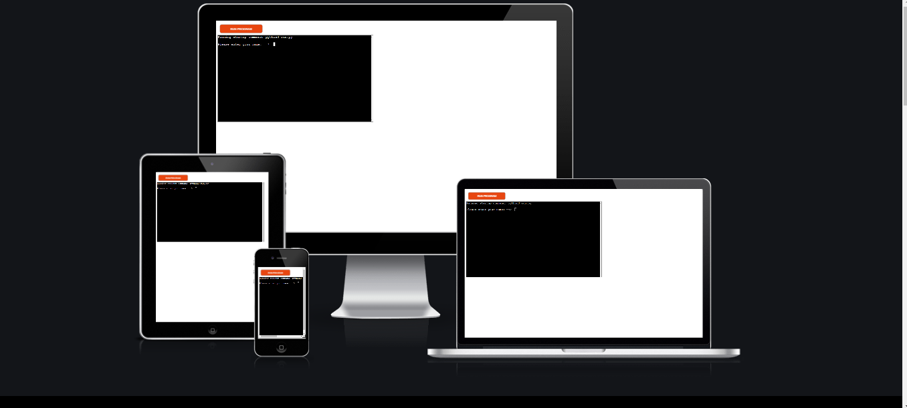
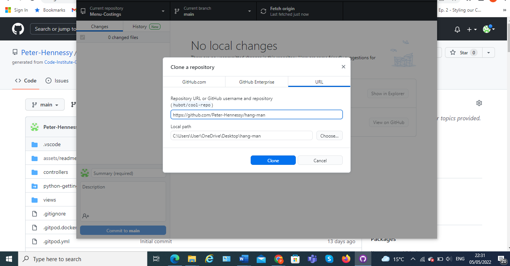

# Hang-man 

## Welcome to <a href="https://hang-man2022.herokuapp.com/" target="_blank" rel="noopener">Hang-man</a> A Game that hangs on a wrong answer

The idea for my project comes from a game I like to play myself, I played as a child with friends and family. ita a really simple game abut can keep you entertained for hours if needed. 

# Contents

* [**User Experience UX**](<#user-experience-ux>)
    *  [User Stories](<#user-stories>)
    * [Wireframes](<#wireframes>)
    * [Game Structure](<#game-structure>)
    
* [**Features**](<#features>)
    * [**Home**](<#challenge-menu>
         * [Rules](<#request-demo>)

         
* [**Technologies Used**](<#technologies-used>)
* [**Testing**](<#testing>)
* [**Deployment**](<#deployment>)
* [**Credits**](<#credits>)
* [Content](<###content>)
*  [**Acknowledgements**](<#acknowledgements>)

# User Stories
- As a user I want to be able understand what I need to do to start  the game
- As a user I need to be able to see clearly understand what I need to do
- As a user I need to be able to see text and images clearly
- As a user I need to be able to understand the rules of the game
- As A user I need to want to return to the game after the initial game is finished

 [Top](<#contents>)

# Game Structure
* The game begin by asking the name of the user their name to invite them in on a personal level
* For the game I created a game where the player has 8 lives to guess a word thorught the process of elimination
* If the user gets a incorrect letter, then a piece of the hangman image will appear
* Every letter tha is guessed will appear as to avoid repitition in the guesses
* If all guesses are made a message will appear to say the user is free to go, or needs to be taken to the undertaker, depending on the outcome

 [Top](<#contents>)

 # Future Features

 - In the future I would like to create a game where the numbers were pre selected using a specific algorithm, At the moment the game only has 3 boards with content, But it has 3 time levels which may add to the challenge

 [Top](<#contents>)

 
 
# Technologies Used
* [HTML5](https://html.spec.whatwg.org/) - provides the content and structure for the website.
* [CSS](https://www.w3.org/Style/CSS/Overview.en.html) - provides the styling.
* [Balsamiq](https://balsamiq.com/wireframes/) - used to create the wireframes.
* [Gitpod](https://www.gitpod.io/#get-started) - used to deploy the website.
* [Github](https://github.com/) - used to host and edit the website.
* [JavaScript](https://www.w3schools.com/js/) - provides the interactivity for the game

 [Top](<#contents>)

# Testing

Please refer to [**_here_**](TESTING.md) for more information on testing

 [Top](<#contents>)

# Deployment

### **To deploy the project**
Deploying your app to heroku
1. IN YOUR TERMINAL ON GITPOD Login to heroku and enter your details. to do this, type the following
command: heroku login -i
2. Get your app name from heroku.
command: heroku apps
3. Set the heroku remote. (Replace <app_name> with your actual app name)
command: heroku git:remote -a <app_name>
4. Add, commit and push to github
command: git add . && git commit -m "Deploy to Heroku via CLI"
5. Push to both github and heroku
command: git push origin main
command: git push heroku main

MFA/2FA enabled?
1. Click on Account Settings (under the avatar menu)
2. Scroll down to the API Key section and click Reveal. Copy the key.
3. Enter the command: heroku_config , and enter your api key you copied when prompted
4. Complete the steps above, if you see an input box at the top middle of the editor...
 a. enter your heroku username
 b. enter the api key you just copied

  The live link to the Github repository can be found here -  https://hang-man2022.herokuapp.com/

### **To create a local clone of this project**
The method from cloning a project from GitHub is below: 

1. Under the repository’s name, click on the **code** tab.
2. In the **Clone with HTTPS** section, click on the clipboard icon to copy the given URL.
3. In your IDE of choice, open **GitHub Desktop**.
4. Change the current working directory to the location where you want the cloned directory to be made.
5. Press **clone**, and a local clone will be created

 [Top](<#contents>)

# Credits
 

 [Top](<#contents>)

# Acknowledgements
- The project was completed as a Portfolio Project 3 piece for the Full Stack Software Developer (e-Commerce) Diploma at the [Code Institute](https://codeinstitute.net/). 

- The concept for the game came from a online tutorial, [redFlyer Coding](https://m.youtube.com/c/redflyercoding). 
 
- I would like to acknowledge the [Slack Community](https://slack.com/) for the help and the eagerness to help others in this community, also the encouragement and support that is given from students in similar situations as yourself
- Also [Kasia Boguka](https://github.com/bezebee) for her help & guidance with the project, and support and encouragement, and is always there to answer any questions

 [Top](<#contents>)