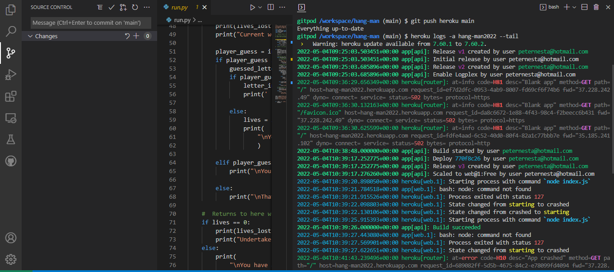
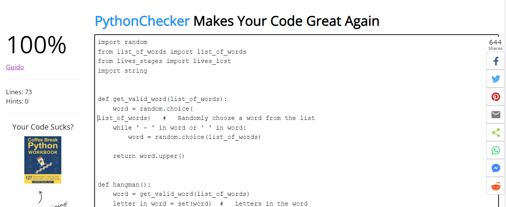
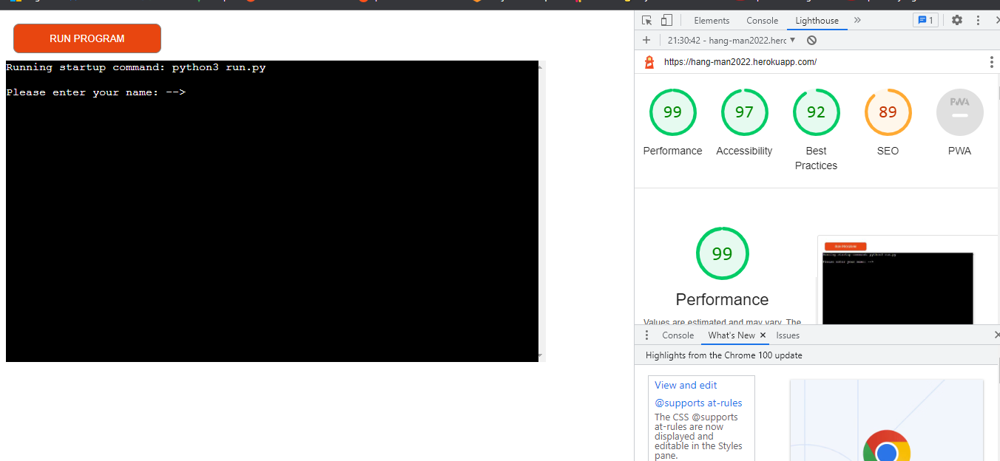
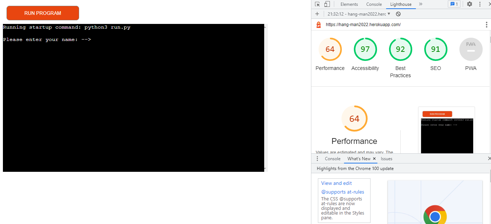

# Testing

## Bugs & Display Errors
* The biggest bug I had in creating the game was indentation, 

- Corrected errors and  ran validator test and post results below

# Bugs during project build
- During the game the images display, when a life was lost,  were not displaying clearly, again the was a result of incorrect indentation

- Due to a security issue the game could not be deployed as per the tutorial, but after reaching out fellow student Shona O Brien advised of the correct method

- I could not upload the game to Heroku, this was due to an error in my repository, A duplicate requirments text file was created. this was discovered with the help and guidance of John in [Tutor support](https://learn.codeinstitute.net/ci_support/diplomainsoftwaredevelopmentecommerce/support)

## Code Validation

- The Hang-man game has been thoroughly tested. All the code has been run through the [Python pep8](http://pep8online.com/)

## Browser Compatibility

Hang-man game was tested on the following browsers with no visible issues for the user.
Google Chrome, Microsoft Edge, Safari and Mozilla Firefox. Appearance, Functionality, and Responsiveness were consistent throughout for a range of browsers.

## Responsiveness Test

### Biggest Bug
 The biggest bug I had in creating the game was indentation, revisted the project content and started again. 

* The Visual Responsiveness was done on [Am I Responsive](http://ami.responsivedesign.is/)

* The responsive design tests were carried out manually with [Responsive Design Checker](https://www.responsivedesignchecker.com/).

|        | Moto G4 | Galaxy S5 | iPhone 5 | iPad | iPad Pro | Display <1200px | Display >1200px |
|--------|---------|-----------|----------|------|----------|-----------------|-----------------|
| Display| pass    | pass      | pass     | pass | pass     | pass            | pass            |

# Testing User Stories

## As a user I want to be able Know what I need to do to start  the game
* On opening, and after pressing the **Run Program** the user is asked to enter their name, and then told the rules of the game

    

##  As a user I need to be able clearly understand what I need to do
* The rules of the game are displayed clearly at the the top of the game, and reminded after every guess

 

## As a user I need to be able to see text and images clearly
* All images are displayed in a markdown format, and all lives and guesses are displayed after every guess

  

##  As a user I need to be able to understand the rules of the game
* The rules are simply explained in relation to guesses and lives, the user is constantly reminded of the lives remaining, and also the letters guessed

 

##  As a user I need to want to return to the game after the initial game is finished
* On Completion of the game , if the user guesses the full word or looses all lives,  the game can be reset via the **RUN PROGRAM** button

## Additional Testing

### Lighthouse
-The site was also tested using [Google Lighthouse](https://developers.google.com/web/tools/lighthouse) in Chrome Developer Tools to test each of the pages for:

- Performance - How the page performs whilst loading.
- Accessibility - Is the site accessible for all users and how can it be improved.
- Best Practices - Site conforms to industry best practices.
- SEO - Search engine optimisation. Is the site optimised for search engine result rankings.

### Future features
- I need to improve performance on a mobile device

# Desktop

# Mobile

Return to [README.md](./README.md#testing).

[Top](#testing)
